# Finance Data Application

## Introducción

El proyecto consiste en una aplicación de ingeniería de datos programada en Python, con Apache Airflow corriendo sobre Docker y Google Cloud como plataforma de nube.

Los datos se extraen diariamente de la API polygon.io, se almacenan en un bucket de GCS en formato parquet, se transforman y se cargan en una base de datos de Google BigQuery. El pipeline finaliza con un mail indicando la fecha lógica de la corrida y el estado.

La información se procesa y analiza mediante consultas sql, pandas, y se presenta en formato jupyter notebook y vía web app utilizando dash.

Se validan resultados con el módulo yfinance.

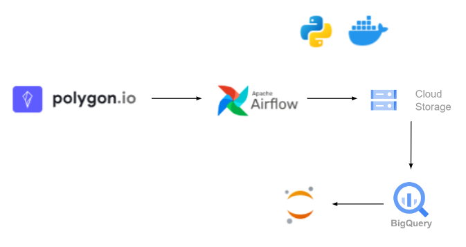

## Despliegue de Apache Airflow

Para desplegar Airflow mediante docker compose (en Windows) se debe descargar el archivo .yaml ejecutando en consola en el directorio de trabajo:

```bash
curl 'https://airflow.apache.org/docs/apache-airflow/2.7.1/docker-compose.yaml' -o 'docker-compose.yaml'
```
Para customizar la imagen que viene por default, se descomenta la línea 54 y se añaden los requerimientos al Dockerfile:

```docker
FROM apache/airflow:2.7.1 
ADD requirements.txt . 
RUN pip install --no-cache-dir apache-airflow==${AIRFLOW_VERSION} -r requirements.txt
```

En esta etapa se deben configurar las variables para utilizar el EmailOperator que se desarrolla más adelante. En la línea 67 se agregan las siguientes variables:

```yml
    AIRFLOW__EMAIL__EMAIL_BACKEND: airflow.utils.email.send_email_smtp
    AIRFLOW__SMTP__SMTP_HOST: smtp.office365.com
    AIRFLOW__SMTP__SMTP_STARTTLS: True
    AIRFLOW__SMTP__SMTP_SSL: False
    AIRFLOW__SMTP__SMTP_USER: nicojapaz@hotmail.com
    AIRFLOW__SMTP__SMTP_PASSWORD: ${PASSWORD}
    AIRFLOW__SMTP__SMTP_PORT: 587
    AIRFLOW__SMTP__SMTP_MAIL_FROM: nicojapaz@hotmail.com
```

La variable de entorno PASSWORD se setea en un .env en la raíz del .yaml.

Para verificar que se lee correctamente la variable de entorno, en el directorio de trabajo ejecutar en consola:  

```bash
docker compose config
```

El despliegue se inicializa con el comando:

```bash
docker compose up
```

## Credeciales Google Cloud

En el servicio IAM se crea una cuenta de servicio:

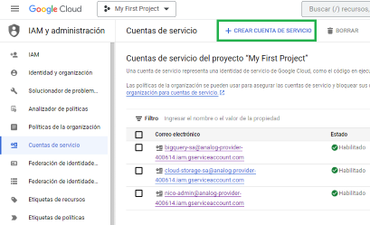

Se asignan los roles necesarios, en este caso BigQuery Admin, Cloud Storage Admin y creador de objetos de almacenamiento. También se puede asignar el permiso total con el rol propietario.

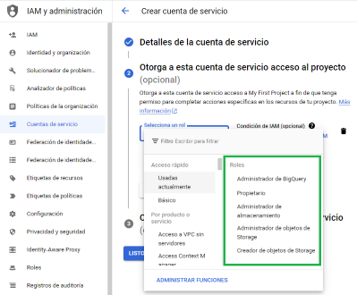

Luego se crea la clave en formato json. En este proyecto se renombra el archivo generado como credentials.json y se ubica en el directorio de las funciones del dag, es decir, en '/dags/data'

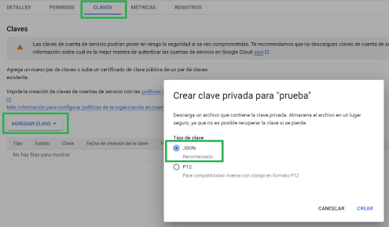

## DAGs

El volume dags creado al desplegar Airflow está estructurado con un directorio '/data' en el cual se encuentra el archivo de funciones 'app_functions_optim.py' que serán utilizadas desde el PythonOperator.

La función api_call llama a la API utilizando el módulo requests dentro de una estructura try/except. En el caso de que la conexión sea válida pero se trate de un día de fin de semana o feriado en US, es decir, sin actividad de mercado, la función retorna el objeto: 

```python
{"msg":"No market ops day"}
```

En caso de conexión válida y actividad de mercado, el objeto json response se transforma a un df con las columnas de interés, y se guarda en el bucket
mediante el protocolo gcs. El nombre del archivo es la fecha lógica del contexto de Airflow. La función retorna:

```python
{"msg":"Data loaded"}
```
En caso de error, la función retorna el status_code del objeto response.

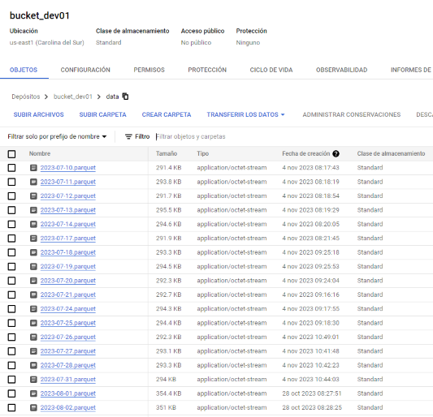

La función bucket_to_bq toma la fecha lógica del contexto, se conecta al bucket, lee el archivo parquet, y lo carga en la base de datos según el schema indicado.
Si no encuentra el archivo correspondiente a esa fecha (porque no hay actividad de mercado o error), retorna:

```python
{"msg":"No file to load"}
```

En este proyecto las columnas de interés consideradas son:
nombre del ticker "T", 
precio de cierre del día "c", 
precio de apertura "o", 
precio más alto "h", 
precio más bajo "l", y 
fecha "date" en formato STRING YYYY-MM-DD.

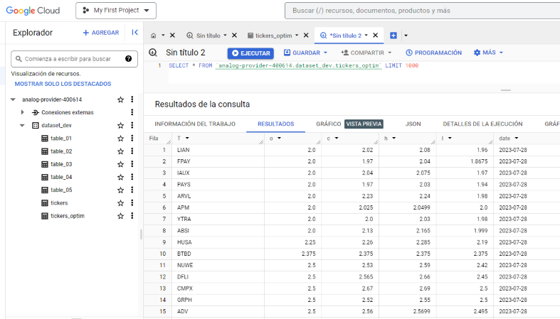


Finalmente se configura el EmailOperator para notificaciones. 

En esta etapa se hace uso del context, jinja templates y xcoms para incluir la fecha lógica y el retorno de la función de carga en el cuerpo del mail:

```python
email = EmailOperator(
    task_id='send_email',
    to='nicojapaz@gmail.com',
    subject='Airflow Alert',
    html_content="Date: {{ ds }} - Value: {{ task_instance.xcom_pull(task_ids='llamada_a_api') }}",
    dag=dag
)
```

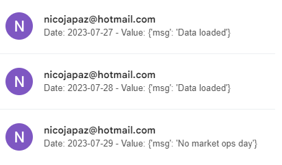

## Data Analysis

En la raíz del repositorio se incluye un directorio '/jupyter-docker' en el cual hay que posicionarse para ejecutar un contenedor de jupyter
a partir de una imagen customizada que tenga en cuenta el 'requirements.txt':

```bash
docker build --rm --tag jupyter-custom-image .
```

Al crear el contenedor se incluye un volumen y se mapean dos puertos, 8888 para la UI de jupyter, y 8050 para la app de dash que se explica más adelante.
En esta etapa se verifica que los puertos no estén ocupados por alguno de los servicios de Airflow.

```bash
docker run -it --rm -p 8888:8888 -p 8050:8050 -v .:/home/jovyan/work --name container-nico jupyter-custom-image
```

En el volumen del contenedor se crea el archivo 'data_proc.ipynb'. Dado que se accederá a la nube de Google desde el contenedor, se debe incluir nuevamente el archivo 'credentials.json'.

En la notebook se realizan consultas sql a los tickers de interés, por ejemplo acciones de Intel:

```python
client = bigquery.Client()
sql = """
    SELECT * FROM `analog-provider-400614.dataset_dev.tickers` WHERE T="INTC";
    """
df = client.query(sql).to_dataframe()
df['date'] = pd.to_datetime(df['date'])
```

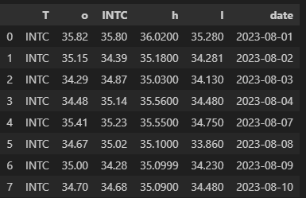

Una vez ordenada la información por fecha, se aplica el método percentual change de pandas .pct_change() sobre la columna de precio de cierre, para obtener la evolución diaria de la tasa de interés de la acción. Se grafica para distintos tickers:

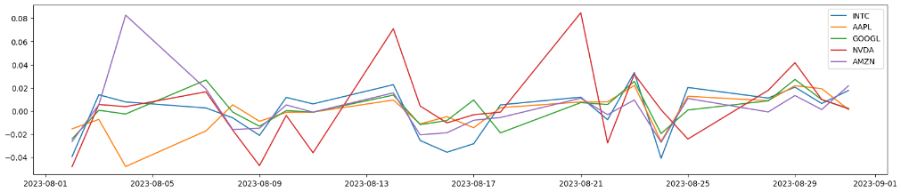

A partir de esta información, se puede calcular el coeficiente de correlación de Pearson:

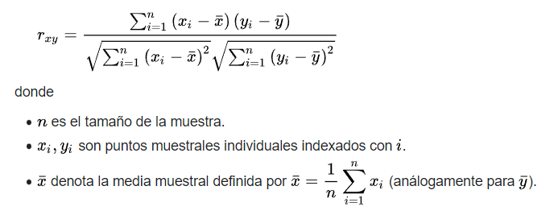

En este caso, x e y representan el cambio porcentual diario de dos tickers. Para una muestra temporal dada, valores cercanos a 1 indican correlación positiva en la evolución de las acciones (si una crece, la otra también), valores cercanos a 0 indican correlación casi nula, y valores negativos cercanos a -1 indican tendencia invertida entre la tasa de dos instrumentos.

Aplicando el método .corr() a la concatenación de las columnas que vamos a relacionar, se obtiene la matriz de correlación:

```python
dfcomp=pd.concat([df2["AAPL"],df5["AMZN"],df3["GOOGL"],df["INTC"],df4["NVDA"]],axis=1).pct_change().corr()
```

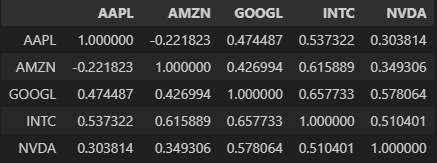

La matriz se puede representar mediante la siguiente visualización:

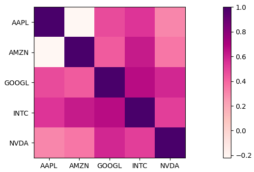

## Validación de resultados

Como método de validación se recurre a la librería open source yfinance basada en información financiera de Yahoo.

Se calcula la matriz de correlación sobre la columna de precio de cierre en las mismas fechas consideradas anteriormente:

```python
dfcomp2 = yf.download(['INTC', 'AAPL', 'GOOGL', 'NVDA', 'AMZN'],start="2023-08-01",end="2023-08-31")['Close'].pct_change().corr()
```

Finalmente se restan los dataframes para obtener la incertidumbre entre las dos fuentes de información:

```python
dfcomp - dfcomp2
```

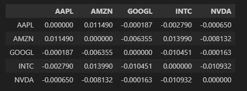

Se concluye que los valores son aceptables (todos los componentes no diagonales de la matriz ~ 0).

## Web App Dash

Como complemento se propone una visualización mediante un servidor web en dash.
Nos conectamos al contenedor:

```bash
docker exec -it container-nico bash
```

Nos paramos en el directorio '/work/data' y ejecutamos en la consola del contenedor:

```bash
python web_app_script.py
```

Con este comando se levanta un servidor web en el puerto 8050 y a modo de ejemplo en la ruta //localhost:8050 se muestra la matriz de correlación
calculada con yfinance y con estilos de Bootstrap.

## Github Actions

En el directorio .github/workslows se encuentra el archivo main.yml a partir del cual en cada push o pull request al repositorio, se ejecuta el test ubicado en '/testing/api_test.py'. Para manejar la API_KEY se configura como variable de entorno en el .yml y se crea un secret en github:
```yml
name: Python application test with pytest # test

on: [push, pull_request]

env:
  api_key: ${{ secrets.API_KEY }}
``` 

## Conclusiones

Se automatizó un pipeline con Apache Airflow para obtener data financiera diaria a partir de la API polygon.io. Se utilizó Google Cloud como plataforma y se contrastaron los resultados obtenidos con la librería open source yfinance. 